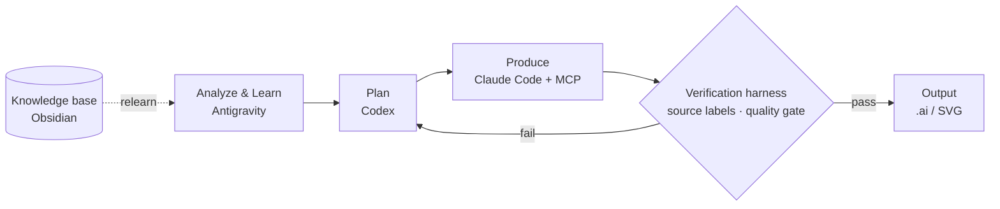

# Multi-Agent AI Design Automation Pipeline

*[한국어 →](README.md)*

> A personal project that splits design-production work across several AIs by **role**, with a
> **verification gate between every stage** to guarantee the trustworthiness of the output.

Not a pile of prompts — a *system* with **role separation, source verification, and quality gates**,
designed and built from scratch by a non-CS designer, self-taught.

---

## The Problem

Design production is repetitive: `analyze → plan → produce → review`. Handing all of it to a single
AI causes two failures: (1) context blurs as the chain grows, and (2) the AI fabricates facts as if
they were true (**hallucination**). So instead of "one smart AI," I use **role-separated agents plus
verification gates**.

## Pipeline

| Stage | AI | Why this AI |
|---|---|---|
| Analyze & learn | **Antigravity** (Gemini) | Strong at visual material + large context |
| Plan | **Codex** | Rigorous, systematic planning |
| Produce | **Claude Code + MCP** | Coding, orchestration, direct tool control |
| Verify | **Custom harness** | Source labels + quality gates block hallucination |

## Key Engineering

- **Claim labeling** — every output is tagged `observed / source-verified / inferred / needs-check`,
  so unsupported statements can't be asserted as fact.
- **Verification harness** — fixed I/O contracts and automatic check scripts between stages; output
  that fails the gate cannot advance.
- **Direct tool control (MCP)** — Claude Code + MCP drive Adobe Illustrator directly and
  extract/recompose existing design elements.
- **Knowledge accumulation** — work knowledge is stored in an Obsidian knowledge base and fed back
  for relearning.

## Code Demos

Standalone, **runnable** re-implementations of the core techniques → **[`code/`](code/)**,
design notes in **[`docs/`](docs/)** (15 tests run in CI).

- [`code/pipeline-orchestration/`](code/pipeline-orchestration/) — the project's backbone:
  **role separation + verification gates + retry**
- [`code/data-contract/`](code/data-contract/) — the **inter-stage input contract** (learning-table
  schema + validator)
- [`code/illustrator-automation/`](code/illustrator-automation/) — drive Illustrator from Python +
  ExtendScript and verify output with **anchor parity** *(`--mock` runs on any OS)*
- [`code/claim-verification/`](code/claim-verification/) — force **source labels** on AI output and
  block hallucinations with **deterministic rules**

> Contains no company/client data — minimal reproductions of the same engineering ideas.

## What This Demonstrates

> A non-CS designer can build a working system with the skill of **"designing what to ask the AI,
> and how."** Deep domain understanding plus AI-system design is a capability that should carry
> directly over to new problems and media.
