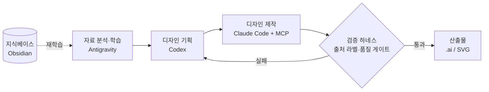

# 멀티에이전트 AI 디자인 자동화 파이프라인

*[English version →](README.en.md)*

> 디자인 제작 업무를 여러 AI에게 **역할별로 분담**시키고, 각 단계 사이에 **검증 단계**를 두어
> 결과물의 신뢰성을 보장하는 개인 프로젝트입니다.

단순한 프롬프트 모음이 아니라, **역할 분리 · 출처 검증 · 품질 게이트**를 갖춘
하나의 *시스템*으로 직접 설계했습니다. 개발 비전공자가 독학으로 구축했습니다.

---

## 문제의식

디자인 제작은 `자료 분석 → 기획 → 제작 → 검수`로 이어지는 반복 작업이 많습니다.
이 전부를 하나의 AI에게 맡기면 두 가지 문제가 생깁니다.

1. 단계가 길어질수록 **맥락이 흐려져** 품질이 떨어진다.
2. AI가 근거 없는 내용을 사실처럼 만들어내는 **환각(hallucination)** 이 발생한다.

그래서 "하나의 똑똑한 AI"가 아니라, **역할이 나뉜 여러 AI + 검증 장치**로 접근했습니다.

## 파이프라인 구조

| 단계 | 담당 AI | 선택한 이유(강점) |
|---|---|---|
| 자료 분석·학습 | **Antigravity** (Gemini) | 시각 자료 처리 + 대용량 컨텍스트에 강함 |
| 디자인 기획 | **Codex** | 엄격하고 체계적인 계획 수립에 강함 |
| 디자인 제작 | **Claude Code + MCP** | 코딩·오케스트레이션, 외부 도구 직접 제어에 강함 |
| 검증 | **검증 하네스** (직접 설계) | 출처 라벨·품질 게이트로 환각을 차단 |

## 핵심 엔지니어링

- **출처 라벨링 (claim labeling)**
  모든 출력에 `관찰 · 출처확인 · 추론 · 확인필요` 라벨을 강제합니다.
  근거가 없는 내용은 사실로 확정되지 못하게 막아, AI의 환각을 구조적으로 차단합니다.

- **검증 하네스 (quality gate)**
  단계와 단계 사이에 *정해진 입출력 형식*과 *자동 점검 스크립트*를 둡니다.
  검증을 통과하지 못한 산출물은 다음 단계로 넘어가지 못하고 이전 단계로 되돌아갑니다.

- **도구 직접 제어 (MCP)**
  Claude Code와 MCP(Model Context Protocol)로 **Adobe Illustrator를 AI가 직접 제어**하고,
  기존 디자인 요소를 추출·재조합하는 단계까지 구현했습니다.

- **지식 축적·재학습**
  작업 과정에서 쌓인 지식을 **Obsidian 기반 지식베이스**로 축적해,
  다음 분석 단계가 이를 다시 학습하도록 연결했습니다.

## 기술 스택

`Claude Code` · `MCP (Model Context Protocol)` · `Adobe Illustrator` ·
`Antigravity / Gemini` · `Codex` · `Obsidian`

## 코드 데모

핵심 기법을 공개용으로 새로 작성한 **실행되는 독립 예제**입니다 → **[`code/`](code/)** · 설계 문서는 **[`docs/`](docs/)** · 테스트(15종)는 푸시마다 CI 자동 실행

- [`code/pipeline-orchestration/`](code/pipeline-orchestration/) — **역할 분리 + 검증 게이트 + 재시도**로 단계를 잇는 파이프라인 골격 *(이 프로젝트의 심장)*
- [`code/data-contract/`](code/data-contract/) — 단계 사이 **입력 계약(학습표) 스키마 + 검증기**
- [`code/illustrator-automation/`](code/illustrator-automation/) — Python + ExtendScript로 Illustrator를 직접 구동하고 결과물을 **앵커-패리티**로 자동 검증 *(`--mock`으로 OS 무관 실행)*
- [`code/claim-verification/`](code/claim-verification/) — AI 출력에 **출처 라벨**을 강제하고 환각을 **결정론적 규칙**으로 차단하는 품질 게이트

> 회사/고객 자료는 포함하지 않습니다. 실제 운영 코드가 아닌, 같은 엔지니어링 아이디어의 최소 재현입니다.

## 현재 상태

- [x] `분석 → 기획 → 제작 → 검증` 으로 이어지는 멀티에이전트 파이프라인 구조 구현
- [x] MCP를 통한 Adobe Illustrator AI 제어 및 디자인 요소 추출·재조합 동작
- [x] 출처 라벨링·검증 하네스로 환각 차단 규칙 설계
- [x] 반복 제작 업무의 작업 시간을 크게 단축
- [x] 핵심 로직 데모화 + 테스트 15종(pytest) + CI 자동 실행
- [ ] (진행 중) 검증 하네스 고도화 · 지식베이스 재학습 자동화

## 이 프로젝트가 보여주는 것

> 개발 비전공자도 **"AI에게 무엇을, 어떻게 시킬지 설계하는 능력"** 으로
> 실제로 동작하는 시스템을 만들 수 있습니다.

도메인(디자인)을 깊이 이해하는 사람이 AI를 *하나의 시스템*으로 다뤄 본 경험은,
다른 새로운 문제와 매체에도 그대로 확장될 수 있는 역량이라고 생각합니다.

---

본 저장소는 개인 프로젝트의 **구조와 접근법**을 소개하기 위한 것으로,
실제 업무 자료·고객 정보는 포함하지 않습니다.
